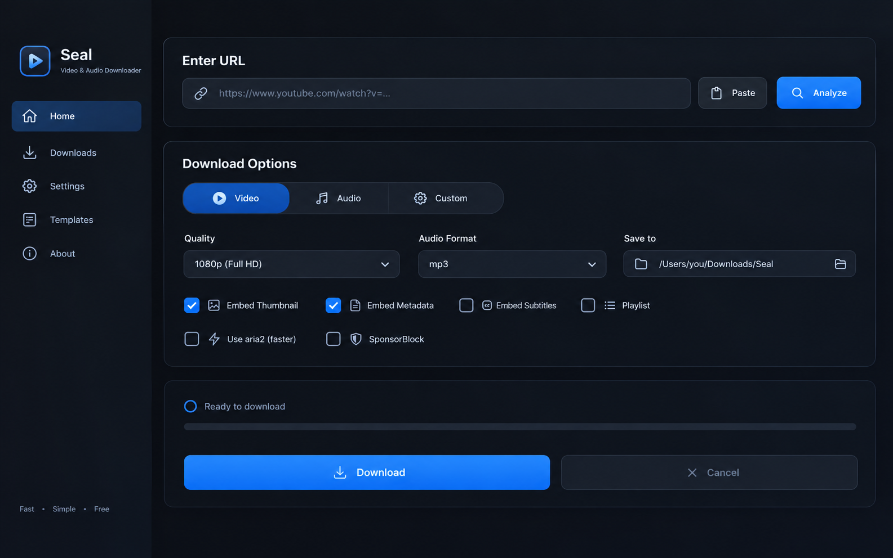

# Video Man

Video Man is a Windows desktop video and audio downloader powered by [yt-dlp](https://github.com/yt-dlp/yt-dlp). It provides a modern graphical interface for downloading media from supported websites, converting audio, downloading playlists, embedding metadata, and managing reusable download commands.

> Video Man is an independent Windows application. Availability and download behavior depend on yt-dlp extractors and the terms of the website or service being accessed.

## Contents

- [Features](#features)
- [Screenshots](#screenshots)
- [Requirements](#requirements)
- [Installation for Users](#installation-for-users)
- [Build the Application](#build-the-application)
- [Run from Source](#run-from-source)
- [Using Video Man](#using-video-man)
- [Playlist Downloads](#playlist-downloads)
- [Custom Command Templates](#custom-command-templates)
- [Optional Tools](#optional-tools)
- [Configuration](#configuration)
- [Project Structure](#project-structure)
- [Git Workflow](#git-workflow)
- [Troubleshooting](#troubleshooting)
- [Development](#development)
- [License and Credits](#license-and-credits)

## Features

- Download video or audio from websites supported by yt-dlp.
- Select best available, 4K, 2K, 1080p, 720p, 480p, or 360p video quality.
- Extract MP3, M4A, OPUS, FLAC, WAV, or best-quality audio.
- Analyze playlists, select individual entries, and download entries separately.
- Use separate download options on the Home and Playlist tabs.
- Embed thumbnails and metadata.
- Download and embed subtitles.
- Remove supported SponsorBlock categories.
- Use aria2c as an optional external downloader.
- Save and reuse custom yt-dlp command templates.
- Monitor progress, speed, ETA, status, cancellation, and history.
- Persist settings in the user's profile.
- Build a standalone Windows executable with a custom application icon.

## Screenshots

Add screenshots to `assets/screenshots/`, then update the paths below.

### Home tab



## Requirements

### Required

- Windows 10 or later.
- Python 3.10 or later.
- Internet connection for package installation and media downloads.
- A URL supported by yt-dlp.

### Recommended

- FFmpeg for video merging, audio conversion, thumbnail embedding, metadata processing, and subtitle embedding.
- aria2c for optional accelerated downloads.

Python must be installed and available through the Windows `PATH`. During Python installation, enable **Add Python to PATH**.

## Installation for Users

These steps install the dependencies and build the Windows executable.

### 1. Install Python

Download Python from <https://www.python.org/downloads/windows/>.

During setup:

1. Enable **Add Python to PATH**.
2. Complete the installation.
3. Open a new Command Prompt or PowerShell window.

Verify the installation:

```bat
python --version
```

The version should be Python 3.10 or newer.

### 2. Download the project

Clone the repository:

```bat
git clone https://github.com/sunil-rajpurohit/Video-Man.git
cd Video-Man
```

You can also use **Code > Download ZIP** on GitHub and extract the project folder.

### 3. Run setup

From the project folder, run:

```bat
setup.bat
```

The setup script will:

- Check that Python is installed.
- Upgrade pip.
- Install packages from `requirements.txt`.
- Check for FFmpeg and attempt a WinGet installation if it is missing.
- Check whether aria2c is available.

### 4. Build the application

After setup finishes, run:

```bat
python build.py
```

PyInstaller creates the standalone application here:

```text
dist\Video-Man.exe
```

Double-click `dist\Video-Man.exe` to start Video Man. The executable includes the icon from `assets\Icon_OG.png`.

## Build the Application

Complete Windows build commands:

```bat
git clone https://github.com/sunil-rajpurohit/Video-Man.git
cd Video-Man
python --version
setup.bat
python build.py
```

Expected output:

```text
dist\Video-Man.exe
```

From PowerShell:

```powershell
python .\build.py
```

The build configuration is defined in [build.py](build.py) and [Seal.spec](Seal.spec). The executable is a one-file, windowed application.

## Run from Source

For development or troubleshooting, run the application directly:

```bat
python -m venv .venv
.venv\Scripts\activate
python -m pip install --upgrade pip
pip install -r requirements.txt
python src\main.py
```

Leave the virtual environment with:

```bat
deactivate
```

## Using Video Man

### Download a single video or audio file

1. Open Video Man.
2. Paste a supported URL into the Home tab.
3. Select **Analyze**.
4. Choose **Video**, **Audio**, or **Custom** mode.
5. Choose the quality or audio format.
6. Select the destination folder.
7. Enable metadata, thumbnail, subtitle, aria2c, or SponsorBlock options as needed.
8. Select **Download**.

The progress area displays status, percentage, speed, and ETA when available.

### Cancel a download

Select **Cancel** during an active download. Video Man requests cancellation from yt-dlp and updates the status when the operation stops.

### Download history

Open the **Downloads** tab to review application download records and status information.

## Playlist Downloads

1. Open the **Playlist** tab.
2. Paste a playlist URL.
3. Select **Analyze**.
4. Review the discovered entries.
5. Select or clear individual entries.
6. Choose the Playlist tab's download options.
7. Select **Download** beside an entry.

Playlist entries are downloaded individually, so each entry has its own progress and cancellation status.

## Custom Command Templates

The **Templates** tab lets you save and reuse yt-dlp command arguments.

The `{url}` placeholder is replaced with the URL being downloaded. yt-dlp output placeholders such as `%(title)s`, `%(id)s`, and `%(ext)s` can be used in output templates.

Example:

```text
-f "bv*[height<=1080]+ba/b" --embed-thumbnail --embed-metadata {url}
```

The application includes example templates for best video and audio, MP3 audio with thumbnail and metadata, and faster downloads using aria2c.

## Optional Tools

### FFmpeg

FFmpeg is recommended for merging separate video and audio streams, converting audio, embedding thumbnails, processing metadata, and embedding subtitles.

```bat
winget install Gyan.FFmpeg -e
ffmpeg -version
```

You can also download FFmpeg from <https://ffmpeg.org/download.html> and add it to `PATH`.

### aria2c

aria2c is optional and can be enabled from the download options.

```bat
winget install aria2.aria2
aria2c --version
```

## Configuration

Video Man stores settings in:

```text
%USERPROFILE%\.video-man\settings.json
```

The default download folder is:

```text
%USERPROFILE%\Downloads\Video Man
```

Settings include the download folder, video height, audio format, metadata, thumbnails, subtitles, aria2c and FFmpeg paths, SponsorBlock, output filename template, browser cookie source, and custom templates.

Close Video Man before manually editing `settings.json`. Invalid JSON may cause the application to load default settings.

## Project Structure

```text
Video-Man/
├── assets/
│   ├── Icon_OG.png       # Application icon
│   ├── icon.png          # Additional image asset
│   ├── icon.webp         # Additional image asset
│   └── screenshots/      # Project screenshots
├── src/
│   ├── main.py           # Main window, pages, and UI event handling
│   ├── downloader.py     # yt-dlp integration and download execution
│   ├── settings.py       # Persistent settings management
│   ├── templates.py      # Custom command template management
│   └── utils.py          # FFmpeg, aria2c, clipboard, and formatting helpers
├── build.py              # PyInstaller one-file build script
├── Seal.spec             # PyInstaller spec configuration
├── requirements.txt      # Python dependencies
├── setup.bat             # Windows dependency setup script
├── setup.sh              # Unix-like setup helper
└── README.md             # Project documentation
```

## Git Workflow

### Clone and update

```bat
git clone https://github.com/sunil-rajpurohit/Video-Man.git
cd Video-Man
git branch --show-current
git status
git pull origin main
```

Replace `main` if the repository uses another default branch.

### Create a feature branch

```bat
git switch -c feature/your-feature-name
```

### Stage and commit changes

```bat
git add .
git diff --cached
git commit -m "Describe your change"
```

### Push changes

For a new branch:

```bat
git push -u origin feature/your-feature-name
```

For an existing branch:

```bat
git push origin main
```

Useful commands:

```bat
git remote -v
git log --oneline --decorate -5
git pull --rebase origin main
```

If a rebase has conflicts, resolve the files, then run:

```bat
git add .
git rebase --continue
git push origin main
```

Do not commit generated `build/` and `dist/` output unless release binaries are intentionally tracked.

## Troubleshooting

### `python` is not recognized

Install Python and enable **Add Python to PATH**, then open a new terminal.

### Package installation fails

```bat
python -m pip install --upgrade pip
python -m pip install -r requirements.txt
```

### FFmpeg or aria2c is missing

FFmpeg is recommended for merging and post-processing. aria2c is optional; disable **Use aria2c** if it is not installed.

### The executable is not created

Run these commands from the project root:

```bat
python -m pip install -r requirements.txt
python build.py
```

A successful build creates `dist\Video-Man.exe`.

### A website does not download

Update yt-dlp:

```bat
python -m pip install --upgrade yt-dlp
```

Some services require authentication, cookies, a supported extractor, or additional configuration. Use downloaded content only where you have permission and follow the website's terms.

## Development

Before submitting changes, run:

```bat
python -m py_compile src\downloader.py src\settings.py src\templates.py src\utils.py src\main.py build.py
```

Run the application locally with:

```bat
python src\main.py
```

When changing the UI, verify both the Home and Playlist download option flows. When changing packaging, verify that `assets\Icon_OG.png` is included and that `dist\Video-Man.exe` is generated.

## License and Credits

Video Man is released under the GPLv3 license. See the repository license file for the complete terms.

This project uses:

- [yt-dlp](https://github.com/yt-dlp/yt-dlp) for media extraction and downloading.
- [CustomTkinter](https://github.com/TomSchimansky/CustomTkinter) for the desktop interface.
- [Pillow](https://python-pillow.org/) for image handling.
- [Mutagen](https://mutagen.readthedocs.io/) for media metadata support.
- [PyInstaller](https://pyinstaller.org/) for Windows executable packaging.

Please respect copyright, privacy, authentication requirements, and the terms of service of every website used with Video Man.
